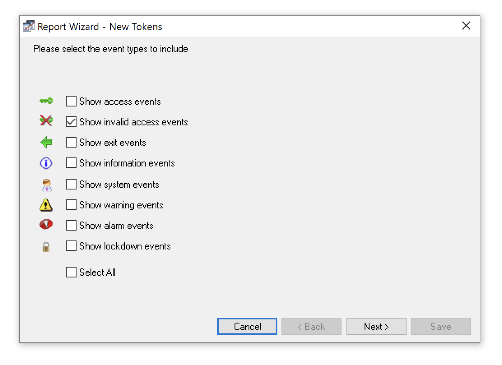

# Paxton Net2 Bulk Add Tokens CLI Utility

A small utility for creating an import file for use with a Paxton Net2 database.

This utility accepts a CSV file containing new token numbers and outputs a file that can be used to import all of the tokens into the database.
### Requirements
- This utility should work on all systems with Python3 installed, there are no package dependencies.

### Usage

```cmd
python3 net2-add-tokens.py
```

Before you begin, you will need a CSV file containing a list of the new token number to add. 
One way to get this is to present all new tokens to an installed reader and create a report to show all _'Invalid access events'_ at that reader. 

The utility can accept the exported CSV file this report would make.



> [!WARNING]
> Ensure the report only contains the tokens you want to add as new users by restricting the start and end time of the report.

The utility will prompt you for the following details:
1. **Name:** The name to give the users. All users will be created with this forename, and their surname will be their order in the original CSV file.
2. **Start ID:** The User ID to start assignment at in the Net2 database.
3. **Access Level:** The access level to assign to the new users.
4. **Department:** The department to place all new users in.


